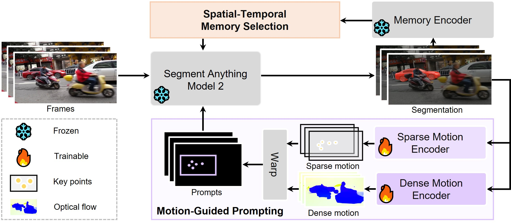
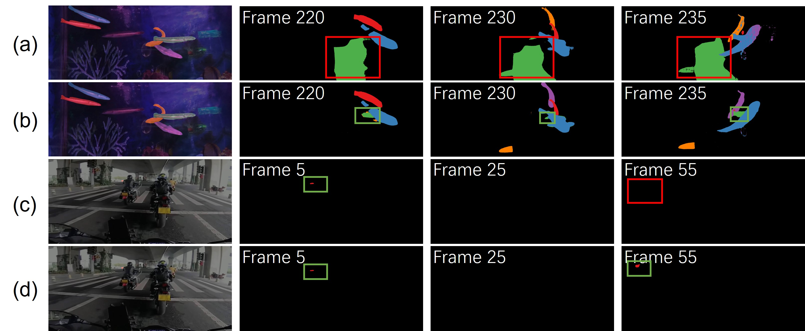

<div align="center">

# MoSAM: Motion-Guided Segment Anything Model with Spatial-Temporal Memory Selection

[Qiushi Yang](https://qiushiyang.github.io/), [Yuan Yao](https://scholar.google.com/citations?user=mpwXqNoAAAAJ&hl=zh-CN), [Miaomiao Cui](https://scholar.google.com/citations?user=C-7UhS9dBroC&hl=zh-CN), [Liefeng Bo](https://scholar.google.com/citations?user=FJwtMf0AAAAJ&hl=en)

[Tongyi Lab, Alibaba](https://tongyi.aliyun.com/welcome) 
</div>

<a href="https://github.com/QiushiYang/MoSAM"></a>
<a href='https://qiushiyang.github.io/MoSAM/'></a>


This repository is the official implementation of MoSAM: Motion-Guided Segment Anything Model with Spatial-Temporal Memory Selection

## 💡 Abstract

The recent Segment Anything Model 2 (SAM2) has demonstrated exceptional capabilities in interactive object segmentation for both images and videos. However, as a foundational model on interactive segmentation, SAM2 performs segmentation directly based on mask memory from the past six frames, leading to two significant challenges.
Firstly, during inference in videos, objects may disappear since SAM2 relies solely on memory without accounting for object motion information, which limits its long-range object tracking capabilities.
Secondly, its memory is constructed from fixed past frames, making it susceptible to challenges associated with object disappearance or occlusion, due to potentially inaccurate segmentation results in memory.
To address these problems, we present MoSAM, incorporating two key strategies to integrate object motion cues into the model and establish more reliable feature memory.
Firstly, we propose Motion-Guided Prompting (MGP), which represents the object motion in both sparse and dense manners, then injects them into SAM2 through a set of motion-guided prompts. MGP enables the model to adjust its focus towards the direction of motion, thereby enhancing the object tracking capabilities.
Furthermore, acknowledging that past segmentation results may be inaccurate, we devise a Spatial-Temporal Memory Selection (ST-MS) mechanism that dynamically identifies frames likely to contain accurate segmentation in both pixel- and frame-level. By eliminating potentially inaccurate mask predictions from memory, we can leverage more reliable memory features to exploit similar regions for improving segmentation results.
Extensive experiments on various benchmarks of video object segmentation and video instance segmentation demonstrate that our MoSAM achieves state-of-the-art results compared to other competitors.

## 📚 Method

<p align="center">

</p>

We present MoSAM, a unified framework that synergistically integrates Motion-Guided Prompt (MGP) and Spatial-Temporal Memory Selection (ST-MS) to enhance motion-aware segmentation with reliable memory management.
To provide motion cues for the model, facilitating superior object tracking and segmentation, MGP captures the motion representation in both sparse and dense manners and then forecasts the subsequence object localization as future prompts.
Considering that the SAM2 memory bank may contain unreliable frame features without objects, ST-MS is designed to adaptively pick up more reliable frame features to update the memory bank by using confidence from both temporal and spatial levels.

## 🎖️ Results

<p align="center">

</p>

Qualitative comparison on video object segmentation. (a), (c) show the results from SAM2, and (b),(d) are drawn from our MoSAM, superior in hard cases including object object disappearance and occlusion. Red boxes suggest the wrong segmentation or object object disappearance, and green boxes indicate accurate segmentation.


## 🚀 Getting Started

#### MoSAM Installation 

SAM 2 needs to be installed first before use. The code requires `python>=3.10`, as well as `torch>=2.3.1` and `torchvision>=0.18.1`. Please follow the instructions [here](https://github.com/facebookresearch/sam2?tab=readme-ov-file) to install both PyTorch and TorchVision dependencies. You can install **the MoSAM version** of SAM 2 on a GPU machine using:
```
cd sam2
pip install -e .
pip install -e ".[notebooks]"
```

Please see [INSTALL.md](https://github.com/facebookresearch/sam2/blob/main/INSTALL.md) from the original SAM 2 repository for FAQs on potential issues and solutions.

Install other requirements:
```
pip install matplotlib==3.7 tikzplotlib jpeg4py opencv-python lmdb pandas scipy loguru
```

#### SAM 2.1 Checkpoint Download

```
cd checkpoints && \
./download_ckpts.sh && \
cd ..
```

#### Main Inference
```
python scripts/main_inference.py 
```

### Input is Video File

```
python scripts/demo.py --video_path <your_video.mp4> --txt_path <path_to_first_frame_bbox.txt>
```

### Input is Frame Folder
```
# Only JPG images are supported
python scripts/demo.py --video_path <your_frame_directory> --txt_path <path_to_first_frame_bbox.txt>
```

## 📖 Acknowledgment

MoSAM is built on top of [SAM 2](https://github.com/facebookresearch/sam2?tab=readme-ov-file) by Meta FAIR. 

The comparisons and this website are also inspired by the concurrent works, [SAMURAI](https://yangchris11.github.io/samurai/) and [SAM2Long](https://github.com/Mark12Ding/SAM2Long)

The VOT evaluation code is modifed from [VOT Toolkit](https://github.com/votchallenge/toolkit) by Luka Čehovin Zajc.


## 🎓 Citation

Please consider citing our paper and the wonderful `SAM 2` if you found our work interesting and useful.
```
@article{ravi2024sam2,
  title={SAM 2: Segment Anything in Images and Videos},
  author={Ravi, Nikhila and Gabeur, Valentin and Hu, Yuan-Ting and Hu, Ronghang and Ryali, Chaitanya and Ma, Tengyu and Khedr, Haitham and R{\"a}dle, Roman and Rolland, Chloe and Gustafson, Laura and Mintun, Eric and Pan, Junting and Alwala, Kalyan Vasudev and Carion, Nicolas and Wu, Chao-Yuan and Girshick, Ross and Doll{\'a}r, Piotr and Feichtenhofer, Christoph},
  journal={arXiv preprint arXiv:2408.00714},
  url={https://arxiv.org/abs/2408.00714},
  year={2024}
}
@article{yao2025towards,
  title={Towards Fine-grained Interactive Segmentation in Images and Videos},
  author={Yao, Yuan and Yang, Qiushi and Cui, Miaomiao and Bo, Liefeng},
  journal={arXiv preprint arXiv:2502.09660},
  year={2025}
}
@article{arxiv_MoSAM_coming_soon,
  title={MoSAM: Motion-Guided Segment Anything Model with Spatial-Temporal Memory Selection},
  author={Yang, Qiushi and Yao, Yuan and Cui, Miaomiao and Bo, Liefeng},
  journal={arXiv preprint arXiv:2503},
  year={2025}
}
```
